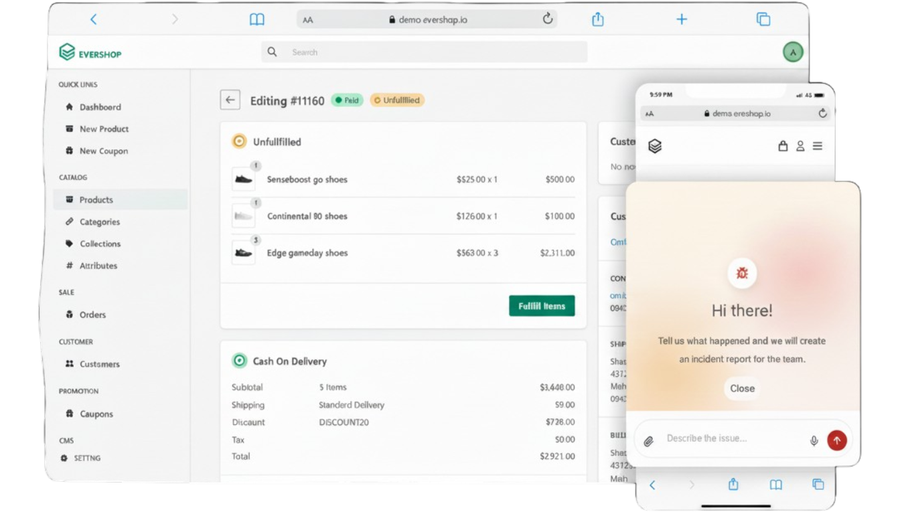

<p>&nbsp;&nbsp;&nbsp;&nbsp;&nbsp;&nbsp;</p>
<p align="center">
  
</p>

<h1 align="center">Incident Triage Copilot for EverShop</h1>

<p align="center">
  Hackathon update: AI-assisted incident intake, triage, RAG code analysis, Jira creation, and reporter notifications.
</p>

<p align="center">
  
  
  
  
  
  
</p>

<p align="center">
  
</p>

## Project Summary

This project extends EverShop with an AI-assisted incident intake and triage workflow.

Users can report incidents from the storefront, and an orchestrator agent:
- gathers the minimum required data conversationally,
- validates reporter email,
- confirms details with the user,
- saves the incident,
- runs technical codebase analysis (RAG),
- creates a Jira ticket,
- and sends reporter notifications.

The user-facing flow is intentionally minimal and safe:
- English-only responses,
- no exposure of internal priority, retrieval, or tool outputs,
- final acknowledgement confirms the issue is being worked on.

> [!IMPORTANT]
> This repository is a hackathon-focused EverShop update, optimized for fast demoability and clear end-to-end incident flow validation.

> [!NOTE]
> The app response shown to end users stays concise, while deeper technical analysis happens in the backend pipeline.

## Architecture Overview

Main runtime components:
- app: EverShop Node.js web application (UI + API proxy route).
- database: PostgreSQL for EverShop data.
- qdrant: Vector store for code chunks.
- rag-api: FastAPI service hosting orchestrator, RAG search, and webhook endpoints.
- rag-indexer: One-shot indexing job for repository ingestion.

High-level request flow:
1. User submits incident through EverShop UI.
2. EverShop app proxies request to rag-api orchestrator endpoint.
3. Orchestrator collects and validates incident details and asks for confirmation.
4. On confirmation, incident is persisted, RAG analysis runs, Jira ticket is created, and email notifications are triggered.
5. User gets concise confirmation message.

Relevant compose files:
- docker-compose.yml: base app + database.
- docker-compose.rag.yml: qdrant + rag-api + rag-indexer overlay.

> [!TIP]
> For quick demos, keep the base stack up and launch the RAG overlay only when validating triage and analysis flows.

## Setup Instructions

Prerequisites:
- Docker + Docker Compose
- Optional local Python 3.11+ (for non-container FastAPI runs)

1. Copy environment template:

```bash
cp rag/.env.example .env
```

2. Fill required secrets in .env:
- OPENAI_API_KEY
- JIRA_* credentials
- SMTP_* credentials (if notifications are enabled)

3. Start stack with RAG overlay:

```bash
docker compose -f docker-compose.yml -f docker-compose.rag.yml up -d --build
```

4. Optional but recommended: build code index:

```bash
docker compose -f docker-compose.yml -f docker-compose.rag.yml --profile manual run --rm rag-indexer
```

5. Verify health:
- GET http://localhost:8008/health
- Open app at http://localhost:3000

## How To Run

<details>
  <summary><strong>Quick Start (recommended for demo)</strong></summary>

  <br/>

  ```bash
  cp rag/.env.example .env
  # Fill OPENAI_API_KEY, JIRA_* and SMTP_* secrets in .env

  docker compose -f docker-compose.yml -f docker-compose.rag.yml up -d --build
  docker compose -f docker-compose.yml -f docker-compose.rag.yml --profile manual run --rm rag-indexer
  ```

  Endpoints:
  - App: http://localhost:3000
  - RAG API health: http://localhost:8008/health
  - Langfuse UI: http://localhost:3010
</details>

<details>
  <summary><strong>Run Base EverShop Only (without RAG overlay)</strong></summary>

  <br/>

  ```bash
  docker compose -f docker-compose.yml up -d --build
  ```

  Use this mode when you only need storefront/admin validation without AI triage pipeline.
</details>

<details>
  <summary><strong>Operational Commands</strong></summary>

  <br/>

  ```bash
  # Follow logs for main services
  docker compose -f docker-compose.yml -f docker-compose.rag.yml logs -f app rag-api qdrant

  # Stop full stack
  docker compose -f docker-compose.yml -f docker-compose.rag.yml down

  # Rebuild only rag-api service
  docker compose -f docker-compose.yml -f docker-compose.rag.yml up -d --build rag-api
  ```

  ```bash
  # Reindex when repository code changes significantly
  docker compose -f docker-compose.yml -f docker-compose.rag.yml --profile manual run --rm rag-indexer
  ```
</details>

<details>
  <summary><strong>Demo Flow Checklist</strong></summary>

  <br/>

  1. Open the storefront and submit an incident.
  2. Complete the conversational intake until confirmation is requested.
  3. Confirm submission and wait for acknowledgement.
  4. Verify orchestrator processing in rag-api logs.
  5. Validate created ticket/notification behavior with configured integrations.
</details>

> [!WARNING]
> If OPENAI_API_KEY or Jira credentials are missing, incident persistence may still work but automated analysis and ticket creation can fail.

> [!CAUTION]
> Running without indexing will reduce analysis quality because RAG retrieval has limited or no code context.

## Repository Deliverables

This repository includes required handoff artifacts for the hackathon track:

- README.md
- docker-compose.yml
- docker-compose.rag.yml
- rag/.env.example
- LICENSE

Expected in final handoff package:

- AGENTS_USE.md
- SCALING.md
- QUICKGUIDE.md
- .env.example (root-level)

## Notes

- The orchestrator includes prompt-level hardening and safety constraints to reduce risky instruction-following patterns.
- The post-confirmation execution pipeline is designed to run asynchronously so user-facing latency stays low.
- Hackathon emphasis: concise UX in storefront, technical depth in backend services.
